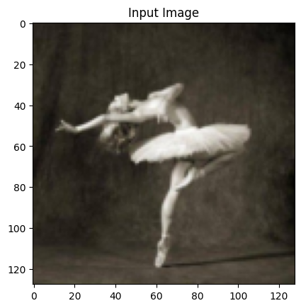
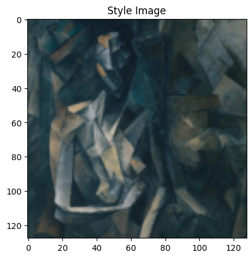
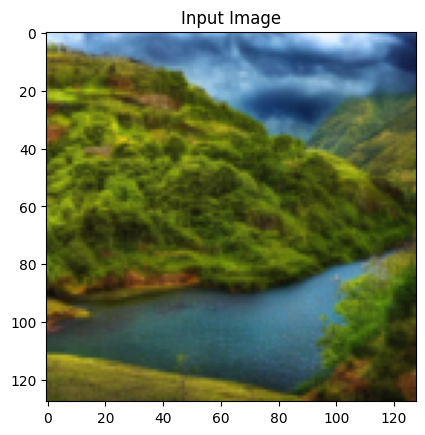
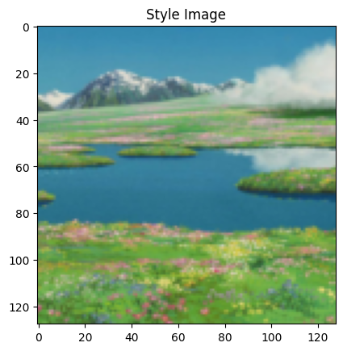
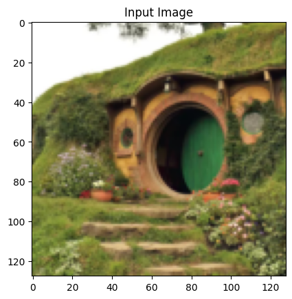
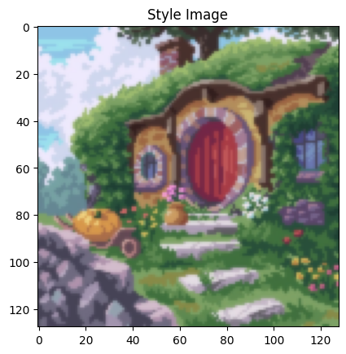

# Neural-Style-Transfer-PyTorch
An implementation of Neural Style Transfer (as shown in Gatys et al).
The project can be cloned and run directly as long as Pytorch and Pillow are installed and configured properly.
Alternatively, a jupyter notebook has also been provided which can be run directly on Google Colab.

## Examples:
(Note: All calculations were done using the T4 GPUs provided for free by Google Colab.)

Example 1 (<b>Very High Style-weight</b>, approx.35000000):

Example 2 (<b>Medium Style-weight</b>, approx.100000):

Example 3 (<b>Low Style-weight</b>, approx.50000):

